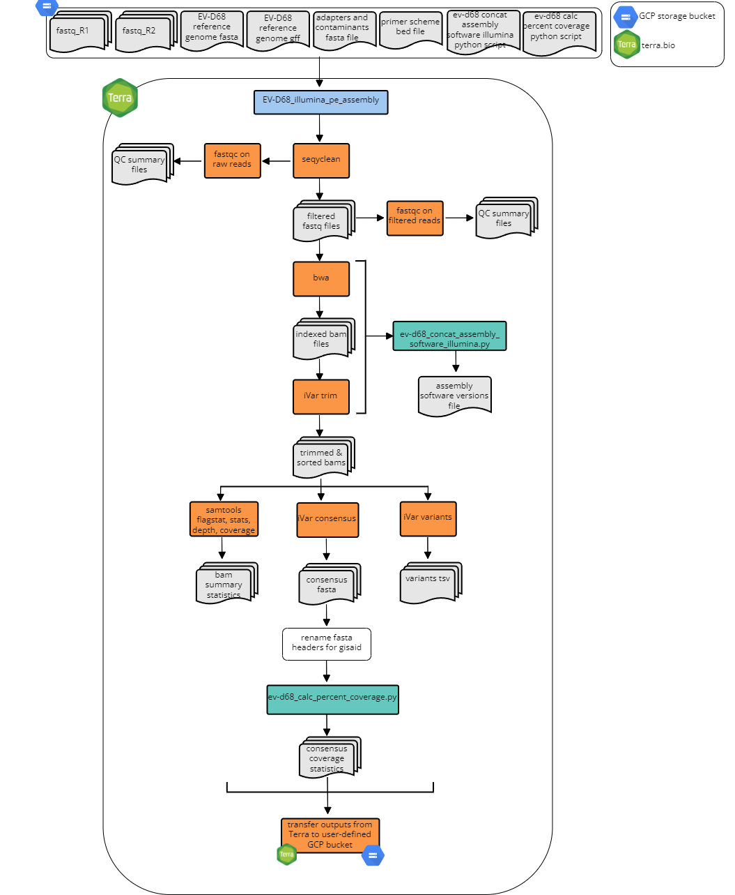
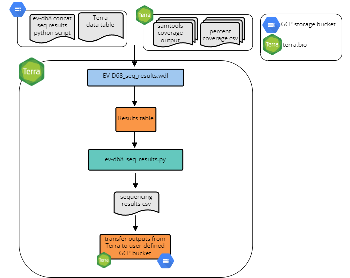

# CDPHE Enterovirus repository

**Disclaimer: Next generation sequencing and bioinformatic and genomic analysis at CDPHE is not CLIA validated at this time. These workflows and their outputs are not to be used for diagnostic purposes and should only be used for public health action and surveillance purposes. CDPHE is not responsible for the incorrect or inappropriate use of these workflows or their results.**

In this repository you will find all things related to Enterovirus D68 (EV-D68) bioinformatics and analysis. The general directory stucture is as follows:

```
CDPHE_EV-D68
| README_EV-D68_overview.md # this document
| dockstore.yml
| workflows # terra workflows you can find in dockstore and push to your terra workspace
      | EV-D68_illumina_pe_assembly.wdl
      | EV-D68_seq_results.wdl
| scripts # custom python scripts for analysess used in wdl workflows
      | ev-d68_calc_percent_coverage.py
      | ev-d68_concat_assembly_software_illumina.py
      | ev_d68_concat_seq_results.py
| workspace_data # reference data
| workflow_diagrams      
```

# CDPHE_EV-D68 Workflows

## Table of Contents

1. [Overview](#overview)
2. [Getting Set Up](#getting-set-up)
3. [Reference Based Assembly Workflow](#reference-based-assembly-workflows)
4. [Results Summary Workflow](#results-summary-workflows)
5. [EV-D68 Genotyping](#evd68-genotyping-method)

## Overview

The following documentation describes the Colorado Department of Public Health and Environments's workflows for the assembly and analysis of whole genome sequencing data for Enterovirus D68 (EV-D68) on GCP's Terra.bio platform. Workflows are written in WDL and can be imported into a Terra.bio workspace through dockstore.

Our EV-D68 whole genome reference-based assembly workflows are highly adaptable and facilitate the assembly and analysis of tiled amplicon based sequencing data of EV-D68. The workflows can accomodate various amplicon primer schemes, as well as diffent sequencing technology platforms including both Illumina and Oxford Nanopore Technology (ONT - COMING SOON!). Below is a high level overview of our workflows followed by detailed descriptions of each workflow which you can access by clicking the dropdown menus.

Briefly, using the platform appropriate assembly workflow on Terra.bio (r.g. ``EV-D68_illumina_pe_assembly``), we perform quality control, trimming, and filtering of raw reads, and perform reference-guided whole genome assembly. Following assembly, intermediate and results files are transfered to a user defined google storage bucket. Next, we produce a results summary file for the set of sequences analyzed using the ``EV-D68_seq_results`` workflow. Finally, genotyping is performed using an open source online tool.

<br/>

## Getting set up

Prior to running any of the workflows, you must set up the terra table and link reference files and custom python scripts to your workspace data. Below is a table detailing the workspace data you will need to set up.

<br/>

#### Workspace data
The reference files can be found in this repository in the ``workspace_data`` directory. Python scripts can be found in the ``scripts`` directory.

| workspace variable name | workflow|  file name | description | 
|:---------------------------------------|:---------------------------------------|:---------------------------------------|:-----------------------------------------------------------------------------------------------------------------------------------------------------|
|``adapters_and_contaminants_fa``|``EV-D68_illumina_pe_assembly``|Adapters_plus_PhiX_174.fasta | adapaters sequences and contaiment sequences removed during fastq cleaning and filtering using SeqyClean. Thanks to Erin Young at Utah Public Health Laboratory for providing this file!|
|``ev-d68_genome_gff``|``EV-D68_illumina_pe_assembly``, ``EV-D68_ont_assembly``|KT285485-1_annotations_20230811.gff|whole genome reference sequence annotation file in gff format (we use NCBI genbank ID KT285485.1 with liftover annotations from NC_038308.1)|
|``ev-d68_genome_fa``|``EV-D68_illumina_pe_assembly``, ``EV-D68_ont_assembly``|KT285485-1.fasta |EV-D68 whole genome reference sequence in fasta format (we use NCBI genbank ID KT285485.1)|
|``primer_bed``|``EV-D68_illumina_pe_assembly``, ``EV-D68_ont_assembly``|{primer_scheme}.primer.bed|primer bed file for your amplicon primer set|
|``ev-d68_calc_per_cov_py``|``EV-D68_illumina_pe_assembly``, ``EV-D68_ont_assembly``|ev-d68_calc_percent_coverage.py|see detailed description in the readme file found in ``./python_scripts/`` repo directory|
|``ev-d68_concat_assembly_software_illumina_py``|``EV-D68_illumina_pe_assembly``|``ev-d68_concat_assembly_software_illumina.py``|see detailed description in the readme file found in ``./python_scripts/`` repo directory|
|``ev-d68_concat_results_py``|``EV-D68_seq_results``|ev_d68_concat_seq_results.py |see detailed description in the readme file found in ``./python_scripts`` repo directory|

<br/>

## Reference-Based Assembly workflows
The following workflows describe the reference based assembly methods for paired-end illumina sequencing data sequencing data. The workflow accepts "sample" as the root entity type. Click the drop down to expand for details. For preprocessing fastq files and generating terra data tables prior to assembly and analysis on Terra.bio, we use the following script and README (https://github.com/CDPHE-bioinformatics/seq_data_preprocessing-private).

<br/>

### EV-D68_illumina_pe_assembly.wdl

### Overview
This workflow was developed for the assembly of Illumina paired-end read data. The workflow accepts "sample" as the root entity type. The workflow will:
1. Use Seqyclean to quality filter and trim raw fastq files
  - Seqyclean parameters include a minimum read length set to 70 bp and quality trimming set to a minimum Phred quality score of 30.
2. Run FastQC on both the raw and cleaned reads
3. Align reads to the reference genome using bwa and then sort the bam by coordinates using Samtools
4. Use iVar trim to trim primer regions and then sort the trimmed bam by coordinates using Samtools
5. Use iVar variants to call variants from the trimmed and sorted bam
  - iVar variants parameters include a minimum quality score set to 20, a minimum variant base frequency set to 0.6 and a minimum read depth set to 10.
6. Use iVar consensus to call the consensus genome sequence from the trimmed and sorted bam
  - iVar consensus parameters include a minimum quality score set to 20, a minimum variant base frequency set to 0.6 and a minimum read depth set to 10.
7. Use Samtools flagstat, stats, depth, and coverage to output statistics from the bam
8. Rename the fasta header of consensus sequences in the GISAID-acceptable format: CO-CDPHE-{sample_id}
9. Calculate the percent coverage using the [ev-d68_calc_percent_coverage.py](./python_scripts/calc_percent_coverage.py) script available in the [python_scripts](./python_scripts/) directory of this repo.
10. Use gsutils to transfer the outputs and results to a user-specified google bucket



<br/>

### Inputs
1. Terra data table.

   The terra data table must include the following columns as listed below. Note that optional columns are not neccessary for the assembly workflow but must be present for the EV-D68_seq_results.wdl workflow described below.

| column header | description | 
|:--------------------|:-----------------------------------------------------------------------------------|
|``entity:sample_id``| column with the list of sample names. (e.g. ``entity:evd68-0203_id``)|
|``fastq_1``|The google bucket path to the R1 fastq file|
|``fastq_2``|The google bucket path to the R2 fastq file|
|``out_dir``|User defined google bucket for where the files will be transfered during the transfer task|
|``terra_data_table_path``|(optional; required for results summary workflow)| 
|``project_name``|(optional; requried for results summary workflow)|

<br/>

2. Terra Workspace Data.

  See [Getting set up](#getting-set-up) above. 

<br/>

3. Setting up the workflow inputs

  For setting up the worklfow inputs, use the ``EV-D68_illumina_pe_assembly-input.json`` in the ``workflow_inputs`` directory.

  |workflow variable| attribute (input syntax into workflow) |
  |:-----------------------------|:--------------------------------------------|
  |``adapters_and_contaminants``|workspace.adapters_and_contaminants_fa|
  |``concat_assembly_software_illumina_py``|workspace.ev-d68_concat_assembly_software_illumina_py|
  |``evd68_calc_percent_coverage_py``|workspace.evd68_calc_percent_coverage_py|
  |``evd68_genome``|workspace.evd68_genome_fa|
  |``evd68_gff``|workspace.evd68_genome_gff|
  |``fastq_1``|this.fastq_1|
  |``fastq_2``|this.fastq_2|
  |``out_dir``|this.out_dir|
  |``primer_bed``|workspace.primers_bed|
  |``sample_name``|this.{entity_name}_id|
  |``project_name``|this.project_name|

<br/>

### Outputs

| WDL task name | software/program | variable name | description |
|:--------------------------|:--------------------------------|:-------------------|:--------------------------------------------------------|
|seqyclean|seqyclean|``filtered_reads_1``|file|
|seqyclean|seqyclean|``filtered_reads_2``|file|
|seqyclean|seqyclean|``seqyclean_summary``|file|
|fastqc as fastqc_raw|fastqc|``fastqc_raw1_html``|file|
|fastqc as fastqc_raw|fastqc|``fastqc_raw2_html``|file|
|fastqc as fastqc_cleaned|fastqc|``fastqc_clean1_html``|file|
|fastqc as fastqc_cleaned|fastqc|``fastqc_clean2_html``|file|
|ivar trim|ivar trim and samtools|``trimsort_bam``|file|
|ivar trim|ivar trim and samtools|``trimsort_bamindex``|file|
|ivar variants|ivar variants|``variants``|vcf file formatted as a tsv|
|ivar consensus|ivar consnesus|``consensus``|fasta file of conensus genome, Ns are called in places with less than 10 bp read depth|
|bam_stats|samtools flagstat, stats, percent_coverage|``flagstat_out``|file|
|bam_stats|samtools flagstat, stats, percent_coverage|``stats_out``|file|
|bam_stats|samtools flagstat, stats, percent_coverage|``covhist_out``|file|
|bam_stats|samtools flagstat, stats, percent_coverage|``cov_out``|file|
|bam_stats|samtools flagstat, stats, percent_coverage|``depth_out``|file|
|rename_fasta|N/A|``renamed_consensus``|fasta file; consesnus genome sequence with the fasta header renamed to be CO-CDPHE-{sample_name}|
|calc_percent_cvg|ev-d68_calc_percent_coverage.py|``percent_cvg_csv``|csv file, see ev-d68_calc_percent_cvg.py script readme for details found in the ./python_scripts directory of this repository|
|align_reads|bwa and samtools|``assembler_software_file`|file recording the version for bwa and ivar|
|align_reads|bwa|``bwa_version`|string recording the version for bwa, this information is used later for submitting to public repositories|
|ivar trim|ivar version|``ivar_version``|String|

<br/>

### EV-D68_seq_results.wdl

This workflow should be run following assembly with one of the reference based assembly workflows. The workflow accepts "sample_set" as the root entity type and uses the data table from either assembly workflows. Both assembly workflows (illumina pe and ont) are compatible with this workflow. Breifly the workflow performs the following:
1. Concaenates sequencing assembly metrics (e.g. percent coverage, assembler version), and sequence metadata (e.g. plate name, sample well location) into a single csv file.
2. Generates a csv file with sequencing assembly metrics that can be used to parse sequencing data into our LIMS.
3. Transfers intermediate and summary files to a user defined google bucket.  



### Inputs
Below is a summary of the workflow input variables along with the syntax used for the attribute column when setting up the workflow to run on Terra.bio. For the attributes, the ""this.sample{terra_datatable_name}s." syntax refers Terra to pull the variable from the terra datatable as used for sample sets. These variables were either in the original terra datatable as inputs for the assembly workflow (see referece based assembly workflow inputs sections above for more details) or added as outputs during the assemlby workflow (see reference based assembly workflow outputs sections for more details). The "workspace." syntax refers Terra to pull the variable from the terra workspace data. Workspace data is describe in the ``Getting Started`` drop down menu above.

|workflow variable| attribute (input syntax into workflow) |
|:--------------------------------|:---------------------------------------------------------|
|``assembler_version_array``|this.sample{terra_datatable_name}s.assembler_version|
|``ev-d68_concat_seq_results_py``|workspace.ev-d68_concat_results_py|
|``cov_out``|this.sample{terra_datatable_name}s.cov_out|
|``out_dir_array``|this.sample{terra_datatable_name}s.out_dir|
|``percent_cvg_csv``|this.sample{terra_datatable_name}s.percent_cvg_csv|
|``project_name_array``|this.sample{terra_datatable_name}s.project_name |
|``renamed_consensus``|this.sample{terra_datatable_name}s.renamed_consesnus|
|``sample_name``|this.sample{terra_datatable_name}s.sample{terra_datatable_name}_id|
|``workbook_path_array``|this.sample{terra_datatable_name}s.workbook_path|

### Outputs
This workflow generates several output files which are transfered to the user defined user google bucket as defined by this.sample{terra_datatable_name}s.out_dir. The table below details each output. For more detailed regarding the values in each column for the outputs see either the software readmes or the readme for the specific python script as listed in the description.

|output variable name| file_name | description | google bucket path|
|:-------------------------------|:----------------------------------------|:--------------------------------------------------------------|-----------------------------------|
|``sequencing_results_csv``|``{seq_run}_sequencing_results.csv``|summary of the sequencing metrics for each sequence generated from the ``ev-d68_concat_seq_results.py``|``gs://{user_defined_gcp_bucket}/summary_results/``|
|``wgs_horizon_report_csv``|``{seq_run}_wgs_horizon_report.csv``|results csv used for parsing results into our LIMS. This file is generated from the ``ev-d68_concat_seq_results.py``|``gs://{user_defined_gcp_bucket}/summary_results/``|

<br/>

### EV-D68 Genotyping

Finally, we use the publicly available Enterovirus Genotyping Tool (available here: https://www.rivm.nl/mpf/typingtool/enterovirus/) for genotyping the consensus genome assemblies.

<br/>

